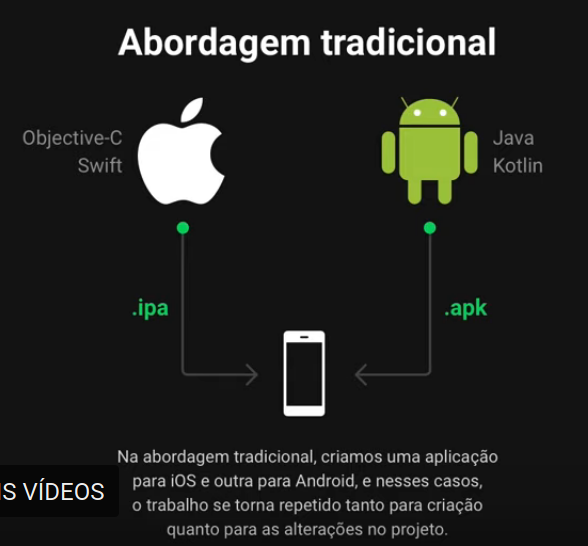
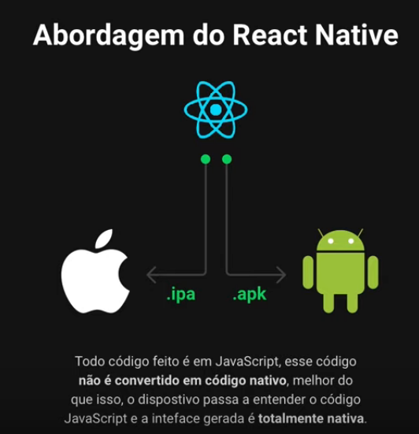

<h1>Minhas anotações - Semana Omnistack 11</h1>

<h2>Dia 1</h2>

<h3>Back End e Front End</h3>

<h4>Back End</h4>

Os bastidores da aplicação. A parte que o usuário não visualiza. É onde fica:

<ul>
    <li>Regras de negócio;</li>
    <li>Conexão banco de dados;</li>
    <li>Envio de e-mail;</li>
    <li>Comunicação com webservices;</li>
    <li>Autentificação do usuário;</li>
    <li>Criptografia e segurança;</li>
</ul>

<!--  -->

<h4>JSON</h4>

<ul>
    <li><em>JavaScript Object Notation</em></li>
    <li>Uma linguagem , "idioma", usada para fazer o meio campo, a comunicação entre o Back End
        e o Front End
    </li>
    <li>É uma estrutura de dados.</li>
</ul>

<h3>Entendendo o React</h3>

<h4>Abordagem tradicional</h4>
<ul>
    <li>Na abordagem tradicional, a cada requisição, o servidor retorna o conteúdo
        completo da página, contendo todo HTML e CSS.
    </li>
    <li>Essa abordagem limita o front-end para o browser já que o aplicativo mobile ou
        serviços externos não vão conseguir interpretar o HTML.
    </li>
</ul>

<h4>Abordagem de SPA</h4>
<ul>
    <li>Na abordagem de SPA (<em>Single Page Application</em>), as requisições trazem apenas
        dados como respostas e, com esses dados, o front-end pode preencher as informações
        em tela.
    <li>A página nunca recarrega, otimizando a performance e dando vida ao conceito de SPA.
        Retornando apenas JSON podemos ter quantos front-ends quisermos.
    </li>
</ul>

<h3>Entendendo o React Native</h3>

<h4>Abordagem tradicional</h4>
<ul>
    <li>Na abordagem tradicional, criamos uma aplicação para iOS e outra para Android, e nesses casos, o trabalho se torna repetido tanto para criação quanto para as alterações no projeto.
    </li>
</ul>

<h4>Abordagem do React Native</h4>
<ul>
    <li>Todo código feito é em <strong>JavaScript</script>, esse código <strong>não é 
        convertido em código nativo, melhor do que isso, o dispositivo passa a entender o código JavaScript
        e a interface gerada é totalmente nativa
    </strong>
    </li>
</ul>

<h4>JavaScript core</h4>
<ul>
    <li>
        O <em>JavaScript core</em> é implementado pelo React Native dentro da nossa aplicação
        iOS/Android. Ele é um framework que dá o entendimento da linguagem JavaScript para o
        sistema operacional mobile.
    </li>
</ul>

<h3>Por que utilizaremos o Expo</h3>

<ul>
    <li>
        É um "framework", um conjunto de ferramentas/bibliotecas pronta para se utilizar a grande
        maioria de funcionalidades do mobile (camera,mapa,sensores,etc).
    </li>
    <li>
        Sem o Expo, precisamos instalar em nosso sistema tanto o Android Studio para obter a
        SDK de desenvolvimento Android, e o Xcode (apenas no Mac) para obter a SDK do iOS.
    </li>
    <li>
        Nesse caso, nossa iniciação no desenvolvimento fica mais penosa, já que essas SDK's 
        não são extremamente simples de instalar e livres de erros
    </li>
    <li><strong>SDK -></strong><em>Software Development Kit</em></li>
</ul>

<h4>Arquitetura do Expo</h4>

<ul>
    <li>Com o Expo, nós instalamos um aplicativo no celular chamado Expo, e dentro dele, tudo
        o que precisamos para desenvolver no React Native já está instalado, como as API's de
        mapas, geolocalização, câmera, sensores, calendário, etc...
    </li>
    <li>
        Com isso, não precisamos nos preocupar em gerar o aplicativo pra Android e iOS já que
        o app do Expo instalado tem tudo o que precisamos e assim usamos apenas React.
    </li>
</ul>