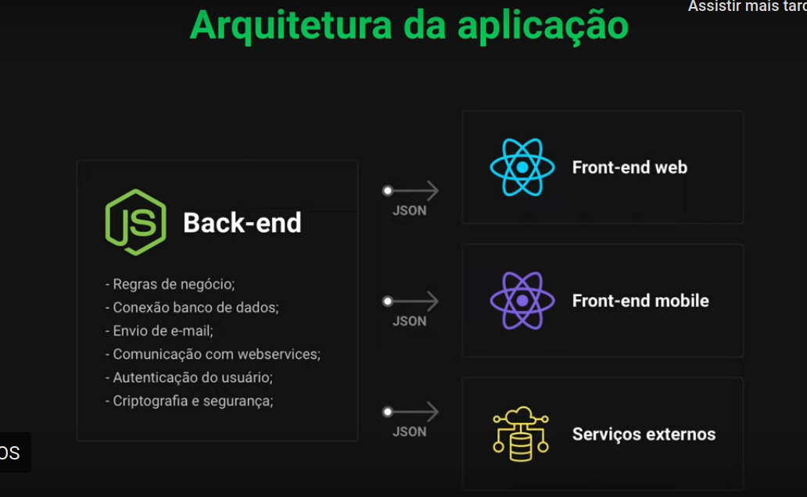

<h1>Minhas anotações - Semana Omnistack 11</h1>

<h2>Dia 1</h2>

<h3>Back End e Front End</h3>

<h4>Back End</h4>

Os bastidores da aplicação. A parte que o usuário não visualiza. É onde fica:

<ul>
    <li>Regras de negócio;</li>
    <li>Conexão banco de dados;</li>
    <li>Envio de e-mail;</li>
    <li>Comunicação com webservices;</li>
    <li>Autentificação do usuário;</li>
    <li>Criptografia e segurança;</li>
</ul>

<!--  -->

<h4>JSON</h4>

<ul>
    <li><em>JavaScript Object Notation</em></li>
    <li>Uma linguagem , "idioma", usada para fazer o meio campo, a comunicação entre o Eack End
        e o Front End
    </li>
    <li>É uma estrutura de dados.</li>
</ul>